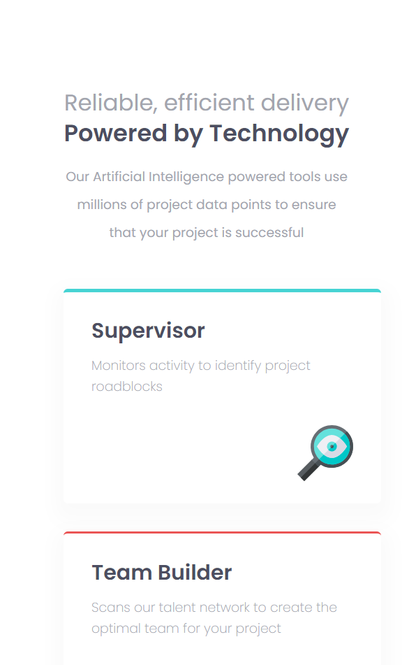
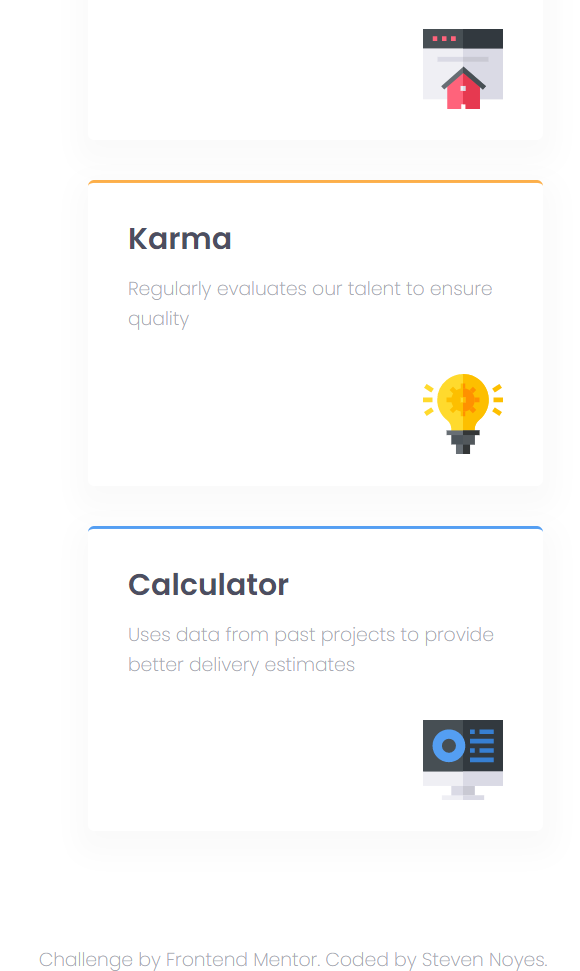
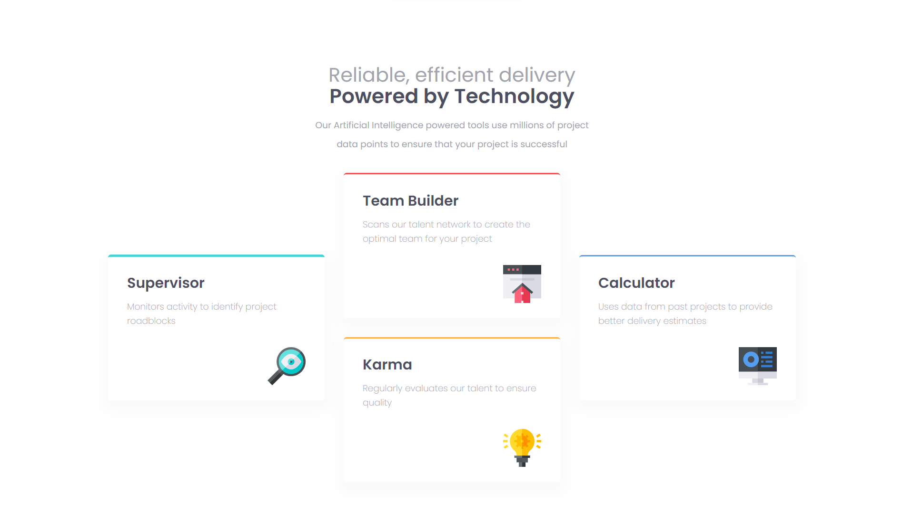

## Table of contents

- [Overview](#overview)
  - [The challenge](#the-challenge)
  - [Screenshot](#screenshot)
  - [Links](#links)
- [My process](#my-process)
  - [Built with](#built-with)
  - [Featured Section](#featured-section)
  - [Useful resources](#useful-resources)
- [Author](#author)

## Overview

### The challenge

Users should be able to:

- View the optimal layout for the site depending on their device's screen size

### Screenshot







### Links

- Solution URL: [GitHub Repo](https://github.com/SteveNoyes/four-card-feature)
- Live Site URL: [GitHub Pages](https://stevenoyes.github.io/four-card-feature/)

## My process

### Built with

- HTML5 markup
- CSS  
- Flexbox
- Mobile-first workflow

### Featured Section

To get the card svgs to align to the right I found it easier to align everything to the right and just change these two text align properties for the text. Though this feels backwards to me I am unsure how.

```css
.card h2 {
  font-size: 24px;
  font-weight: 600;
  padding-bottom: 1rem;
  /* this feels like it's cheating but I'm not sure why */
  text-align: left;
}

.card p {
  line-height: 1.5rem;
  padding-bottom: 2rem;
  /* this too */
  text-align: left;
} 
```

### Useful resources

- [Root Element - REM](https://developer.mozilla.org/en-US/docs/Learn/CSS/Building_blocks/Values_and_units) - This helped me for XYZ reason. I really liked this pattern and will use it going forward. 

- [box-shadow](https://developer.mozilla.org/en-US/docs/Web/CSS/box-shadow) - Box shadow for button and div sections. 

- [text spacing](https://www.w3schools.com/css/css_text_spacing.asp) - Spacing for the top header was made easier with this.

## Author

- Website - [Portfolio](https://www.stevenmnoyes.com)
- Frontend Mentor - [@SteveNoyes](https://www.frontendmentor.io/profile/SteveNoyes)
- GitHub - [SteveNoyes](https://github.com/SteveNoyes)